# Quickstart

> **Every command below has been run, start to finish, from an empty database.**
> The API, worker and parser processes were started against a real Postgres and
> a real Qdrant; `init` created the organization; and each request on this page
> was issued in order — create a layer, issue a grant, ingest, poll the job to
> `indexed`, search as a granted user and get the chunk, search as a user
> without the grant and get nothing. Revoking the grant then removed it from the
> results while the points were still in the index. Four bugs were found doing
> it and are fixed.
>
> **`docker compose --profile minimal up` has now been run too**, from a clean
> clone, and it found three things: the image could not build at all (pnpm
> refuses to replace `node_modules` without a TTY, and a build never has one),
> `.env.example` defaulted the embedding endpoint to a service that only the
> `full` profile starts, and the vector store was pinned to a version its own
> client warns about on every boot. All three are fixed.

## What you will need

- Docker with Compose v2
- 8 GB of RAM for the `minimal` profile
- An embedding endpoint. Any OpenAI-compatible one will do; the `full` profile
  brings its own.

## First run

```bash
git clone https://github.com/nacre-work/nacre && cd nacre
cp .env.example .env
```

**Now set `NACRE_DEFAULT_EMBEDDING_ENDPOINT` in `.env`.** It ships empty on
purpose and the API refuses to start without it, naming the variable. `minimal`
starts no embedder — that is what keeps it runnable on a laptop without a GPU —
so this is a value only you can supply:

```ini
# any OpenAI-compatible /embeddings endpoint
NACRE_DEFAULT_EMBEDDING_ENDPOINT=http://host.docker.internal:8000
```

On `--profile full`, use the embedder that profile brings:
`http://embedder:80`. Either way, `NACRE_DEFAULT_EMBEDDING_DIM` has to match the
model or the index is built with the wrong width and every search misses.

Then:

```bash
docker compose --profile minimal up -d
```

`minimal` starts the API, a worker, PostgreSQL, Qdrant, Redis, and the parser
sidecar, and expects embeddings from an endpoint you name in
`NACRE_DEFAULT_EMBEDDING_ENDPOINT`. Use `--profile full` to run the embedder and
the reranker locally too; see [config.md](./config.md) for the difference.

## After startup — what listens where

Here is every surface a person or an agent talks to, each with a URL the moment
`docker compose up` returns:

| Surface | Where | For |
|---|---|---|
| **Admin UI — your organization** | `http://localhost:8082` | a person: search, layers, grants, service accounts |
| **API** — REST | `http://localhost:8080` | apps, `init`, the SDK — every `curl` on this page |
| **MCP** | `http://localhost:8081/mcp` | agents (Streamable HTTP) |
| **Global admin — every organization** | commercial (`admin-global`); not in this build | a platform administrator, across organizations |

Three of the four are published ports and are up with the stack. The fourth is
worth being explicit about, because it is the whole open-core line:

- The **admin UI** (`web`) serves the static `packages/admin` bundle and proxies
  `/v1` to the API on the same origin — so the browser makes same-origin requests
  and there is no CORS to configure, which matters because the API sends no CORS
  headers on purpose. Sign in with the address and password `init` prints below.
  It is one organization — *your* company.
- The **global admin** — organizations, quotas and the default embedding model
  across the *whole* installation — is the one screen that is commercial. The
  community UI is scoped to the single organization in your token and has no way
  to name another; managing many is `admin-global`, in the enterprise build.

Postgres, Qdrant, Redis and the parser are internal to the Compose network and
deliberately stay that way — nothing outside the stack should reach them. In
production an ingress routes to the API and MCP, and serves the admin bundle on
the API's origin the way the `web` service does here.

Every command below talks to `api`; the mcp port matters once you reach
"Connecting an agent" at the end. If 8080, 8081 or 8082 is already taken on your
machine, set `NACRE_API_HOST_PORT` / `NACRE_MCP_HOST_PORT` / `NACRE_WEB_HOST_PORT`
in `.env` — the host side moves, the ports inside the network do not, and nothing
else changes.

## The first organization

Nothing exists yet — not an organization, not a user, not the Qdrant collection.
One command creates all of it:

```bash
docker compose run --rm api node packages/api/dist/init.js \
  --org acme --email you@example.com --name "Acme"
```

It prints the workspace id, an administrator token valid for one hour, and a
password:

```
Organization acme is ready.

  Workspace id  a2ebffde-29ac-4327-9891-a51f40edce0c
  Admin user    you@example.com

An administrator token, valid for one hour:

  export NACRE_TOKEN=eyJhbGciOiJIUzI1NiJ9…

And a password for signing in, which is not printed again:

  …
```

Run it twice and the second run changes nothing — it reports what already
existed, and **it does not reset the password**. That matters more than it
sounds: a first install that dies halfway leaves exactly the state you would
otherwise have to unpick by hand, and a re-run cannot lock an administrator out
of their own installation.

The token is signed with `NACRE_JWT_SECRET`, printed to a terminal and probably
into a shell history. It exists to get you through this page, which is why it
expires in an hour.

**When it does, sign in for another.** The password above is the one that lasts:

```bash
curl -sX POST http://localhost:8080/v1/auth/login \
  -H 'Content-Type: application/json' \
  -d '{"email":"you@example.com","password":"…"}'
```

```jsonc
{ "access_token": "eyJ…", "token_type": "Bearer",
  "expires_in": 900, "refresh_token": "…" }
```

`POST /v1/auth/refresh` exchanges the refresh token for a new pair, and the old
refresh token stops working the moment it does — replaying one revokes the whole
family, because by then the legitimate holder has already exchanged it and there
is no way to tell which of the two holders is genuine. See
[api.md](./api.md#signing-in).

## A layer, and someone allowed to read it

A document lives in a layer, and a layer lives in a workspace. Nothing is
readable by default — there is no implicit grant to a creator, an owner, or an
administrator of the workspace, which is deliberate and is the thing most
permission systems do differently.

```bash
curl -X POST http://localhost:8080/v1/layers \
  -H "Authorization: Bearer $NACRE_TOKEN" \
  -H "Content-Type: application/json" \
  -d '{ "workspace_id": "…", "slug": "handbook", "name": "Handbook" }'
```

`init` prints the workspace id, and `GET /v1/workspaces` is where to find it
afterwards — that endpoint exists because it is the one id the rest of the API
cannot give you:

```bash
curl -s http://localhost:8080/v1/workspaces -H "Authorization: Bearer $NACRE_TOKEN"
```

It lists the workspaces you can reach, which is not the same as every workspace
in the organization. `POST /v1/workspaces` creates another, and takes
`org_admin` — there is no scope above a workspace to hold a grant on.

A slug already in use answers `409`; a workspace you may not administer answers
`404`, the same as one that does not exist.

Then grant someone `read` on it:

```bash
curl -X POST http://localhost:8080/v1/grants \
  -H "Authorization: Bearer $NACRE_TOKEN" \
  -H "Content-Type: application/json" \
  -d '{
    "principal_type": "user",
    "principal_id": "…",
    "scope_type": "layer",
    "scope_id": "…",
    "permission": "read"
  }'
```

Both need `admin` on the scope in question — on the workspace to create a layer
in it, on the layer to grant against it. Admin on one layer does not let you
grant yourself another. A caller without it gets `404`, the same answer as for a
scope that does not exist, because telling the two apart is how you enumerate
what exists.

Grants are allow-only here. To revoke, delete the grant; `effect: deny` and
`scope_type: document` are commercial and this build refuses them with a `400`
saying so.

`write` does not imply `read` — someone with `write` on a layer can put
documents in it and cannot search them. `admin` implies both. This is the
opposite of most systems and it is not an oversight; see
[authz.md](./authz.md).

## First document

```bash
curl -X POST http://localhost:8080/v1/documents \
  -H "Authorization: Bearer $NACRE_TOKEN" \
  -H "Content-Type: application/json" \
  -d '{
    "layer": "handbook",
    "external_id": "onboarding-2026",
    "title": "Onboarding",
    "content": "New engineers get repository access on their first day."
  }'
```

Ingest is asynchronous and returns `202` with a `job_id`. Poll
`GET /v1/jobs/{id}` until `status` is `indexed`.

## First search

```bash
curl -X POST http://localhost:8080/v1/search \
  -H "Authorization: Bearer $NACRE_TOKEN" \
  -H "Content-Type: application/json" \
  -d '{ "query": "when do new hires get access", "top_k": 5 }'
```

You get back exactly the chunks your token is permitted to see. Not the top 5
filtered down to whatever survived — 5 permitted results, because the filter is
applied inside the index traversal. If that distinction is new, read
[authz.md](./authz.md); it is the reason this project exists.

## The same thing in a browser

Everything above has a screen — search, layers, grants and service accounts, for
one organization — and the stack already serves it. Open
[http://localhost:8082](http://localhost:8082).

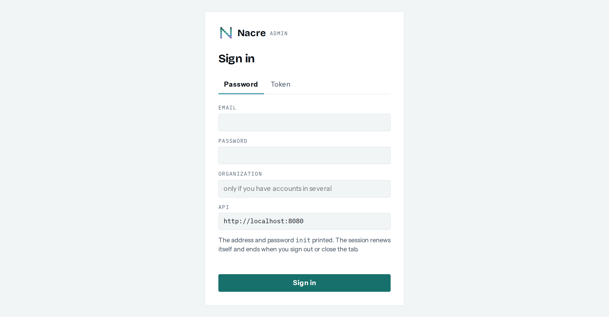

Sign in with the address and password `init` printed. The session renews itself,
so it outlives the hour that token above has. **Leave `API` as it is** — it is
already the origin serving this page, which is what keeps the browser's requests
same-origin. `ORGANIZATION` stays empty unless one address has accounts in more
than one of them.

Pasting the token works too, on the second tab, and so does a service account
key — which is how you look at exactly what an agent can see, from the other
side of this page.

### Layers, and what a fresh installation looks like

This is the screen a new installation actually shows, and the first step nobody
guesses:

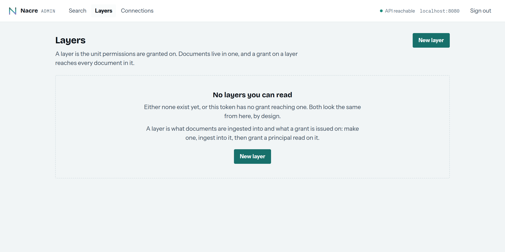

**A layer comes first.** Documents are ingested into one and grants are issued
on one, so until there is a layer there is nothing to ingest into and nothing to
grant on — which is why search on a new installation returns nothing and cannot
say more than that.

The heading says "no layers **you can read**" rather than "no layers", and that
is deliberate rather than cautious: the catalog is permission data, so a fresh
installation and a token with no grant reaching anything have to look the same
from here. Both are worth the same sentence.

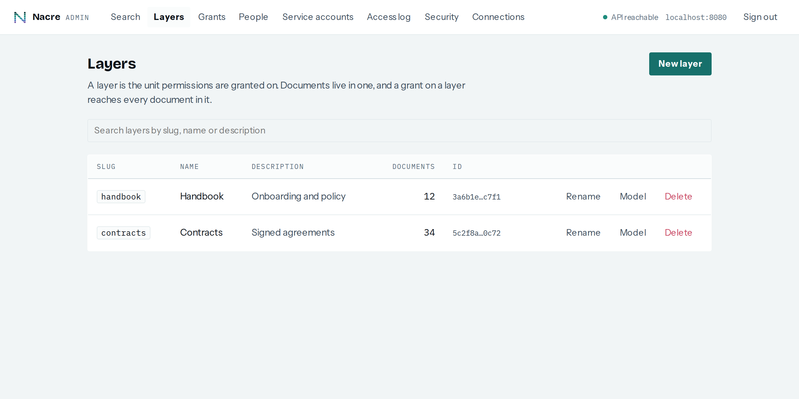

Deleting one takes its documents with it, so the confirmation asks for the slug
rather than for a click — a grant re-issues, and a layer's documents do not come
back. It needs `admin` on the layer's workspace, never `write`: an ingest-only
service account is exactly the principal that holds `write` into a layer and
must not be able to remove it.

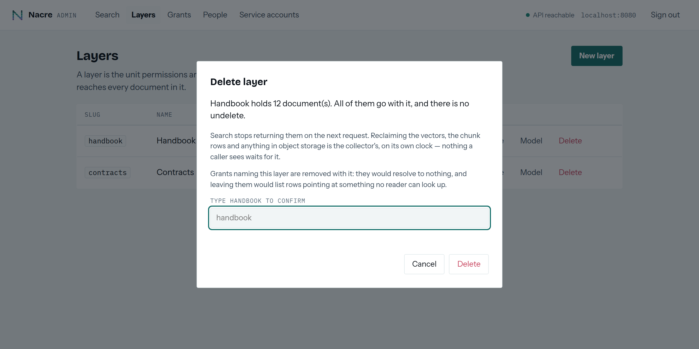

`New layer` asks for the workspace, and the picker is filled from the ones this
token may administer — there is exactly one after `init`, and it is selected
already. The id below it stays editable, for pasting the one `init` printed.

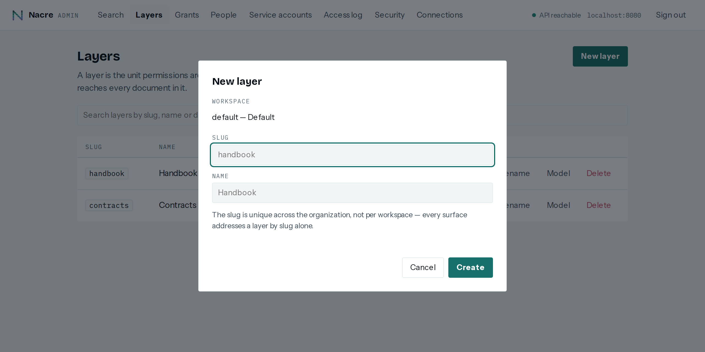

### Search

The screen that answers the question this project exists for: **it runs as the
token you signed in with**, with no administrative bypass. What you see here is
what the same credential gets over REST and over MCP — so signing in as a
service account is how you check what an agent can actually reach.

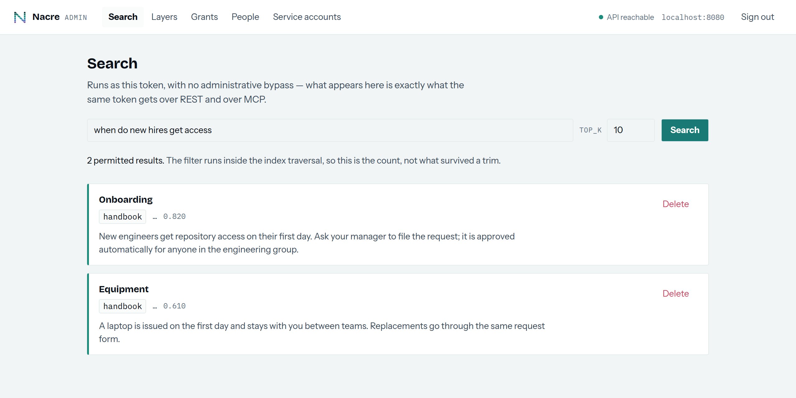

The count says *permitted results*, not *results*, and the difference is the
whole design: the filter runs inside the index traversal, so `top_k` returns k
things you may see rather than k things trimmed down to whatever survived.

### Grants, and service accounts

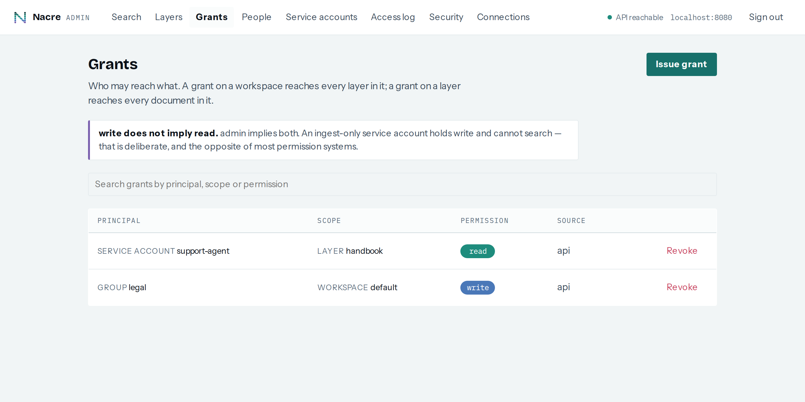

Issuing a grant asks for a principal, a scope and a permission. The scope
shortcut follows the scope type — layers when the scope is a layer, workspaces
when it is a workspace — so an id is something you can paste rather than
something you have to know.

Two rules surprise people, and the screen says both rather than assuming:
`write` does not imply `read`, and a deny beats an allow at any depth.

### People — onboarding a colleague

`init` makes one administrator, and until this screen existed everybody else
had to be inserted into `users` by hand. Nothing about the model required that:
`grants.principal_type` has admitted `user` and `group` since the first
migration.

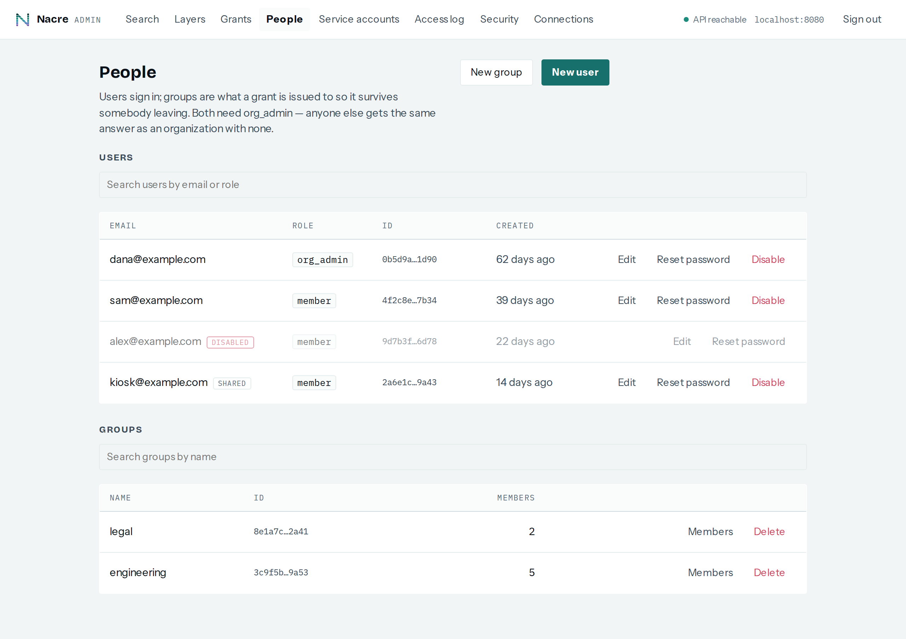

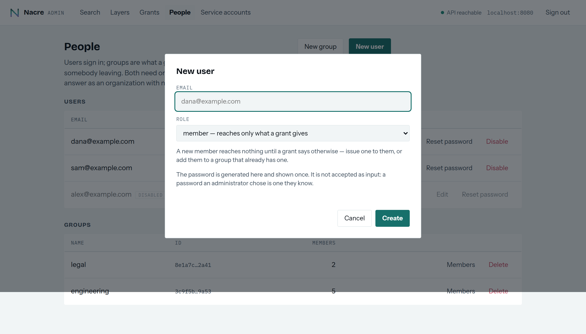

Creating a user generates a password and shows it once — it is not accepted as
input, because a password an administrator chose is one they know, and an
argument ends up in a shell history. Losing it is a reset, not a recovery.

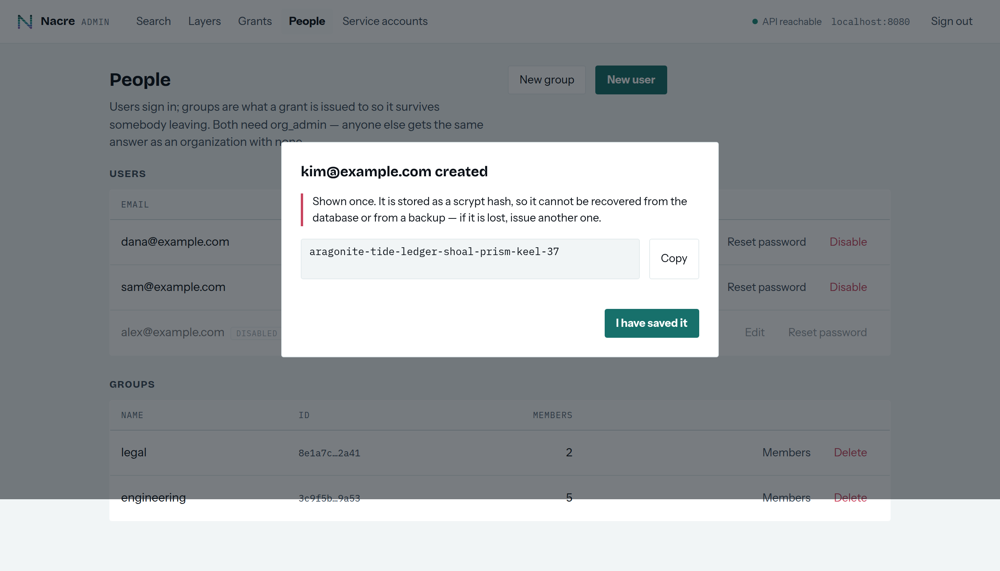

The same treatment the service account key gets, and for the same reason: it is
stored as a scrypt hash, so there is no path from this screen that recovers it.

**A new member reaches nothing.** The role decides whether they can administer
the organization, never what they can read: that is entirely the grants, which
is why an `org_admin` who has issued themselves no grant sees an empty search.

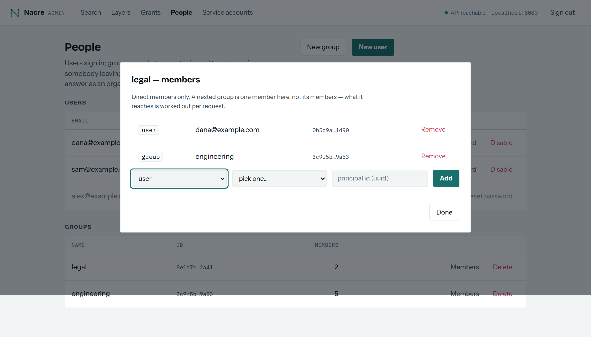

Grant the **group** rather than the person, wherever there is more than one of
them. Adding somebody to a group gives them everything it holds and removing
them takes it back on their next request — the permitted set is computed per
request, so there is nothing to wait for. Granting each person individually is
what leaves an ex-colleague with access nobody remembers to revoke.

Disabling a user stops sign-in and refresh, and keeps the row: the access log
names it. It does **not** revoke their grants, and an access token already
issued keeps working until it expires — `NACRE_ACCESS_TOKEN_TTL` is that
window.

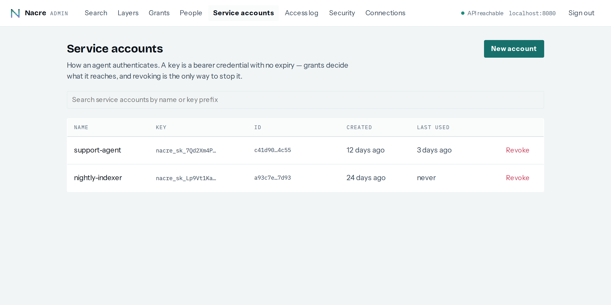

A key is shown once, when the account is made. What is stored is a hash, so it
cannot be read back from the API, the database or a backup — losing one means
minting another, which is the trade for a key that a leaked backup does not
carry.

The screen is `packages/admin`, a static bundle the `web` service serves on its
own origin while proxying `/v1` to the API — so the browser makes same-origin
requests and there is no CORS to configure, which is the point rather than a
detail: the API sends no CORS headers on purpose. In production the arrangement
is the same, one origin fronting the bundle and `/v1`; `docker/nginx.conf` is the
proxy this stack uses and a working example of it. The UI can also be pointed at
a different API from its sign-in screen, which is a real deployment and a
slightly worse one — same-origin is what avoids the header the API declines to
send.

## Connecting an agent

Over MCP, Streamable HTTP — this is the `mcp` container from the table above:

```
http://localhost:8081/mcp
```

In production the same endpoint lives behind the API's host rather than on its
own one — the ingress routes `/mcp` there, so an agent is configured with
`https://api.example.com/mcp` and never needs to know there is a second
process.

Locally, over STDIO, with a service account key. Mint one first — the token
`init` printed expires in an hour and is not a credential for an agent:

```bash
curl -X POST http://localhost:8080/v1/service-accounts \
  -H "Authorization: Bearer $NACRE_TOKEN" \
  -H "Content-Type: application/json" \
  -d '{ "name": "local-agent" }'
```

The `key` in that response is the only time it exists outside your terminal —
it is stored hashed, so it cannot be read back from the API, the database, or a
backup. Lose it and you mint another. Then:

```bash
set -a && . ./.env && set +a          # local mode is the server, in-process
NACRE_SERVICE_KEY=nacre_sk_… npx @nacre.work/mcp
```

The first line is not optional. Local mode has no HTTP hop — it connects to
Postgres, Qdrant, Redis, the parser and the embedder itself — so it needs the
same configuration the server has. Started without it, the process refuses and
lists what is missing rather than half-working. It also means the agent holds
your database credentials, which is the trade for no network hop, and why
anything that is not a laptop should use the Streamable HTTP transport instead.

A new service account can reach nothing at all until you grant it something —
it is a principal like any other, so give it `read` on a layer exactly as you
would a user. The local mode carries exactly those permissions. There is no
developer-convenience relaxation, and there will not be one.

`DELETE /v1/service-accounts/{id}` revokes a key, and it stops working on the
next request: unlike a token this credential has no expiry of its own, so
revocation is the only thing that ever ends it.

## The one thing to get right before production

The OAuth issuer and `/.well-known/*` belong on `api.nacre.work`, not on the
apex domain. Static hosting on the apex intercepts the discovery path, and the
issuer URL is baked into every token you have ever issued — moving it later
breaks every client at once. [mcp.md](./mcp.md) has the detail.
