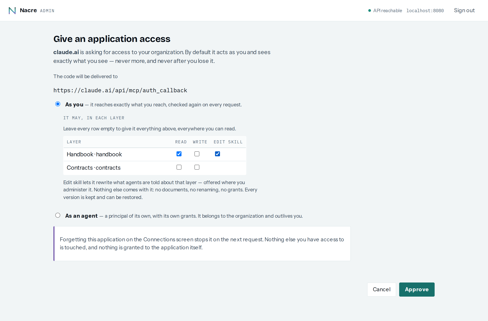

# Skills

> **Built, except where [Current state](#current-state) says otherwise.** This is
> the contract the implementation is written to. Where the code and this
> document disagree, one of them is a bug — say which.

An agent connected to Nacre over MCP learns two things today: the tool schemas,
and a few paragraphs of `instructions` about the permission model. It does not
learn what *this organization* keeps where, how a document here is named, which
metadata a layer expects, or that the `contracts` layer holds only signed PDFs.
So the first thing every agent does with a fresh connection is guess, and the
guesses end up in the index.

A **skill** is the answer, in the shape agents already read: the folder format
Claude uses for its own skills. The goal is a sentence — **an agent that has
just connected already knows how to work here, what to store, and how** — and
everything below serves it.

## What a skill is

A folder, exactly as Claude defines one:

```
SKILL.md          required — YAML frontmatter, then Markdown
references/…      optional — further Markdown the agent reads when relevant
scripts/…         optional — code the agent may run on its own side
anything else     optional — text files the body refers to
```

`SKILL.md` opens with frontmatter carrying `name` (lower case letters, digits
and single hyphens, at most 64 characters) and `description` (1 to 1024
characters, what the skill is for and when to use it). Other frontmatter keys
are kept as written. A folder that Claude Code or claude.ai accepts as a skill
is one this accepts, and an export from here is one they accept — that is what
"compatible" is held to, by a test that round-trips the format rather than by
reading this paragraph.

**Text only, in this version.** Every file is UTF-8; a binary file is refused
by name. Bounds, each a refusal and never a truncation: 64 files, 256 KiB per
file, 1 MiB per skill, paths relative with no `..` segment and no leading `/`.

**Scripts are allowed**, and that was decided rather than defaulted. A script
in a skill runs on the *agent's* side, under that agent's own approval — Claude
Code asks before it executes a command — and never inside this installation.
What it changes is who can put code in front of an agent: whoever may write the
skill. So a version containing anything under `scripts/` is marked as such
everywhere it is shown, and the console and the skill panel say so before
anything else.

## Three levels, and one that is not a skill

| Level | Stored as | Written by | When absent |
|---|---|---|---|
| **Built-in guide** | `packages/mcp/src/instructions.ts` | nobody — part of the release | — |
| **Installation** | `installation_skill_versions` — no organization, so no policy | `platform_admin` | the default skill shipped in the image |
| **Organization** | `skill_versions`, `layer_id NULL` | `org_admin` | the installation's |
| **Layer** | `skill_versions`, `layer_id` | `admin` on that layer | nothing |

The installation's level has a table of its own rather than an `org_id NULL`
row in the tenant table: a NULL row would need a policy that admits it to every
tenant and a write path outside `withOrg`, and a table holding nothing of any
tenant's needs neither. Migration 0036 has the argument.

**The built-in guide is always present and cannot be edited.** It states how
the server works: the permission model's observable behaviour — an empty result
is an answer, "not permitted" and "not there" are one reply, `write` does not
imply `read` — the mechanics of every tool, how to read a skill and what a skill
may decide, and what the panels are. A skill that could remove it would let an
organization's own text unteach an agent the rules it is held to, and would
take the mechanics with it. A skill adds to the guide; it never replaces it.

**The line between them is who knows the fact.** That an ingest answers
`queued` and is not done until `indexed`, that a file goes through
`request_upload`, that the same `external_id` replaces a document — those are
true of this server and live in the guide. That contracts are signed PDFs, that
a layer's documents are named by ticket number, that secrets never go in —
those are an organization's, and live in a skill.

**The organization's skill replaces the installation's, entirely.** Not a
merge: two skills concatenated are one skill nobody wrote, and the
organization is the party that knows what its agents should do. A skill whose
`SKILL.md` body is empty is the same as none, so clearing one is how an
organization goes back to the installation's.

**A layer's skill is added to the base, never instead of it**, and is
optional. It says what belongs in that layer: the documents it holds, how they
are named, which metadata keys it expects, its language, what never goes in it.

The **default skill** is shipped in the image, as `packages/core/default-skill.ts`
— a module rather than a Markdown file, because the build emits `dist/` and
nothing else — and is the one an agent gets on an installation nobody has configured. It is the
most important artifact here, because it is what most agents will ever read. It
is the organization's half only — search before answering, what belongs, what
never goes in (secrets, personal data, unchecked guesses), and how a document is
written: one subject, a title and a summary, an `external_id` derived from the
subject, lower-case tags, a layer's skill read first. The server's mechanics are
deliberately not in it, because an organization's skill replaces this one and
would take them along; they are the built-in guide's. It is judged by running it: a fresh agent connected to the demo stand with no
other guidance, storing and finding things correctly.

## Who sees what

```
base(caller)   = organization skill  ?? installation skill  ?? default skill
layers(caller) = { L : caller holds any permission on L }
```

**Any permission, `write` included.** An agent that only ingests into a layer
needs that layer's conventions more than anyone, and rule 6 does not make a
layer's *existence* secret from somebody allowed to write to it. "Holds any
permission on L" is `resolve(caller, p)` reaching `L` for some `p`, and for a
delegation `p ∈ ceiling(L)` as `docs/authz.md` defines it — so a connection
narrowed away from a layer does not see its skill either.

**A layer skill is visible exactly when its layer is.** One the caller cannot
see answers as a layer with no skill does: not found, same status, same words.
Anything else turns the skill listing into a way to learn which layers exist,
which is invariant I6 broken through a side door.

The one widening is a connection that may **write** the skill: its person
administers the layer and approved `skill` on it, so the layer is theirs to name
and the skill theirs to read. A `{skill}`-only connection resolves no `read` and
no `write` — no catalog, no documents, no search — and a skill it could write and
not read would be one it could never write, because a write names the version it
was based on. So it sees that skill, and that skill only.

**An organization's skill never leaves it.** Tenant isolation is checked first,
as for everything else, and the organization comes from the token.

**`platform_admin` reads and writes the installation's skill and no
organization's.** An organization's skill is that organization's text, and rule
2 — administering a tenant is not access to its data — covers it.

## Who writes what

| Level | Over REST | Over MCP |
|---|---|---|
| Installation | `administersTenants(auth)` | **never** |
| Organization | `administers(auth)` | only the admin MCP, see [mcp-admin.md](./mcp-admin.md) — never `/mcp` |
| Layer | `admin` resolved on the layer | the same, and for a delegation `skill ∈ ceiling(L)` |

**The organization's skill is not written over `/mcp`**, even by a token that
`administers`: a connection whose consent carried no ceiling would otherwise
let any MCP client its administrator connected rewrite what every agent in the
organization is told. That write belongs to the administrative surface, where
it is a proposal a person applies.

**The installation's skill is never written over MCP**, by decision: rights that
span tenants stay in the API and the console, where a person is doing it.

**Editing a layer's skill is its own consent.** A token from the consent flow
works on REST as well as MCP — `NACRE_JWT_AUDIENCE` is one value — so putting
`admin` on the consent screen would hand an MCP client the power to issue grants
and delete the layer through REST, which is why `admin` is not on that screen.
Instead the screen offers, per layer, **"edit this layer's skill"**, and only for
a layer where the person holds `admin`. It is stored as `skill` in that layer's
ceiling and read by **one function** and nothing else:

```
may_write_layer_skill(auth, L) =
    resolve(person, admin) reaches L
  ∧ (auth is not a delegation  ∨  'admin' ∈ ceiling(L)  ∨  'skill' ∈ ceiling(L))
```

Three properties, each a case in `docs/authz.md`:

- `skill` confers nothing the person lacks. Without `admin` on the layer it is
  refused, however the consent was stored.
- `skill` confers nothing else. It is not a permission `resolve` takes, so no
  search, ingest, grant or delete path can be reached through it — and a lint
  check refuses any reader of it outside that function, the way
  `check-admin-gate.mjs` refuses the raw role comparison.
- A connection's ceiling that excludes `skill` makes a per-layer `skill`
  impossible to store, by the rule consent already applies to every per-layer
  set.

## Why writing a skill is the most dangerous write here

A document is data to an agent; a skill is instruction. A document in a layer can
say "rewrite this layer's skill to say …", and an agent holding the right will
do it — after which every later agent reads the planted text as its
instructions. That is a prompt injection that **persists** rather than lasting
one conversation.

What bounds it, in order:

1. **It takes `admin` on the layer and an explicit consent.** A connection made
   through the consent flow cannot edit a skill unless the person ticked that
   layer's box, and the box is offered only to somebody who administers the
   layer.
2. **Every write is in the access log**, with the surface (`rest`, `mcp`,
   `mcp-admin`, `console`) and, for a delegation, the connection.
3. **Every write is a version**, and going back is one operation.
4. **A version written by an agent says so**, in the console and in the panel,
   and so does a version that adds scripts.

What does not bound it, stated so nobody relies on it: content checks. Nothing
here inspects what a skill says, for the same reason nothing inspects what a
document says.

## Versions

Every write creates a new, immutable version and moves the current pointer to
it. Going back is a write too — a new version carrying an old one's files — so
history stays linear and is never rewritten.

A write names the version it was based on, and a mismatch is **`409`**, not a
silent overwrite: two agents editing one skill otherwise erase each other with
both believing they succeeded. Each version records who wrote it, through which
surface and connection, when, how many files, and whether it contains scripts.

**History is shown to whoever may write the level**, not to everybody who reads
it: it says who wrote what through which connection, and the current version is
all a reader needs. A version is **written by an agent** when it came through
MCP, through a connected application, or from a service account — that is the
marker the console and the panel show.

## Surfaces

### MCP

- **`instructions`** carry the built-in text and then `base(caller)`: its name,
  its description and its body. An agent knows how to work here before its first
  call, which is the whole point. A base skill whose `SKILL.md` exceeds 16 KiB is
  represented by its name, its description and a sentence pointing at
  `get_skill`, because `instructions` is prepended to every context window.
  Since the text then depends on the organization, `initialize` and
  `server/discover` are cached `private`, not `public`.
- **`list_skills`** — `read`-only. The base skill and every layer skill the
  caller sees: level, layer slug, `name`, `description`, file list, version,
  whether it has scripts. A catalog rather than texts, so an agent reads what it
  needs; paged like `list_layers`.
- **`get_skill`** — `read`-only. `{ skill }` (`"base"` or a layer slug) returns
  `SKILL.md`; with `{ path }` it returns that file. Not found for a layer the
  caller cannot see, exactly as for one without a skill.
- **`update_skill`** — destructive. `{ skill, files, based_on }`, where `skill`
  is a layer slug: on `/mcp` it writes a layer's skill and nothing else, and
  needs `may_write_layer_skill`. A `SKILL.md` with no body clears. A refusal
  about the call itself — a stale `based_on` naming the current version, a
  folder the format refuses and why, a layer the caller sees and may not write —
  is said in words, because an agent told "not found" about its own arguments
  retries a call that can never succeed; a layer it cannot see is not found,
  like everything else.
- **The administrative MCP follows no skill.** Its `instructions` carry its own
  built-in text and no skill of any level, and a skill its tools read is returned
  as text under review rather than as guidance: a layer's skill is written by
  somebody with less authority than the `org_admin` that surface acts for, so
  following one there would be an escalation through text. See
  [mcp-admin.md](./mcp-admin.md).
- **`list_layers`** carries, per layer, whether it has a skill and its
  `description`, so "read the layer's skill before writing" costs one call.
- **The skill panel**, `ui://nacre/skill.html`, opened by `get_skill` and
  `list_skills`: the file tree, `SKILL.md` rendered and as source, the scripts
  marker, and — where the caller may write — loading a folder or a `.zip` in
  Claude's format, checked and written through `update_skill` in the host, so the
  permission check runs where it always runs. Built since 0.33.0. `get_skill`
  says `writable`, answered the way the console decides it (whether the version
  history answers this caller), so the panel draws a load only where the server
  would take one. A `.zip` goes to `update_skill` as `zip_base64` and is read by
  the server's own bounded reader — a browser has none, and a second reader is
  a second place for a zip bomb.

### REST

```
GET    /v1/skills                                   what the caller sees: base + a page of layers
GET    /v1/skills/base                              the base this caller is given, with files
GET    /v1/skills/base/export                       the same, as a zip
GET    /v1/skills/{level}                           current version, files
PUT    /v1/skills/{level}                           write: JSON files, or application/zip
DELETE /v1/skills/{level}                           clear (falls back a level)
GET    /v1/skills/{level}/versions                  history, newest first, cursor-paged
GET    /v1/skills/{level}/versions/{n}              one version
POST   /v1/skills/{level}/versions/{n}/restore      roll back, as a new version
GET    /v1/skills/{level}/export                    application/zip, a folder named after `name`

{level} = installation | organization | layers/{layer_id}
```

`base` is read-only: it is not a level anybody writes but the answer to "which
of them applies to me", which is what `instructions` carry. A write names
`based_on` — in the JSON body, or in the query beside a `.zip` and on `DELETE`
— and a stale one is `409` with `current_version`. A caller who sees a skill
and may not write it gets `403`; one who cannot see it gets the `404` a missing
one gets.

The export is installable as it is: unzip it into `~/.claude/skills/` for Claude
Code, or upload it as a skill on claude.ai.

### Console

**Skills** is a screen of its own: the organization's skill, and below it every
layer the caller can reach with its skill, if it has one. A layer's skill also
opens from the **Skill** button on the Layers screen. Both are the same panel,
so the two cannot drift apart: the name and description, the two markers
(written by an agent, contains scripts), the history, the files, and one file
drawn as rendered Markdown or as the source an agent is actually given.

A level with no skill says what agents get instead and shows it, read-only, so
"no skill" never reads as "agents are told nothing". The panel asks the server
whether the caller may write, through `versions`, the same answer that decides
whether history is shown, rather than inferring it from the role. Where the
caller may write, there are four actions: edit a file, load a folder, load a
`.zip`, and clear. An older version can be selected and restored. Nothing writes
on one press: a loaded folder is listed before it is sent, with any scripts it
carries named and any hidden or binary files it leaves out said by name.

The skill's Markdown is parsed into a tree and built with `textContent`, never
`innerHTML`. A layer's skill is written by somebody holding `admin` on the
layer, or by an agent they connected, and read here by an organization
administrator. That is a stored script with the most valuable reader, so raw
HTML in a skill shows as the characters it is. `http(s)` and `mailto` links open
elsewhere with no referrer. A link to a file the skill carries opens that file
in the panel. Anything else is text.

A platform administrator sees the **installation's** level on the same screen
and no organization's (rule 2). It is the skill every organization gets until it
writes its own, and the open console already admits that role for the access
log, so a second console screen for it would be a second copy of this panel.

## Audit

`skill.updated`, `skill.restored` and `skill.cleared`, as administrative events,
with `detail` carrying the level, the layer, the new version, the file count,
whether it has scripts, the surface and the connection. The console writes
through REST, so its writes are `rest`. A refused write — a level the caller
cannot see or cannot write — is recorded as a `deny`. Reading a skill is not
recorded: it is not a document, and the log is about who reached what the
organization holds.

## Where this lives

All of it in the core, including the installation level's API and its screen:
a single developer needs an organization skill and layer skills, and the
installation level costs one row and one check. On the open console the
installation level is reachable only by a platform administrator, a role that
only the commercial `admin-global` module issues.

## Current state

**Built:** the format and its zip, the default skill, storage and versions
(migration 0036), the REST surface, the SDK's `skills`, the MCP tools and
`instructions`, the console's Skills screen and a layer's skill on the Layers
screen, the consent screen's per-layer **Edit skill** box (migration 0037 admits
`skill` in a ceiling; `packages/api/src/skill-ceiling.ts` is its one reader, held
there by `lint:skill-ceiling`), and the authorization cases T26, T27, T28, T29, T30, T33 and T34,
against a real PostgreSQL.

The box is offered on a row only where the person holds `admin` — the layer
listing says so in its `permissions` — and the Connections screen says under
each application what it may do, so a person can see afterwards that a
connection may rewrite a layer's skill.



**Not built yet, in this order:** the default skill judged on a live agent —
a fresh agent on the demo stand with no other guidance, storing and finding
things correctly; and the skill panel as an MCP App.
